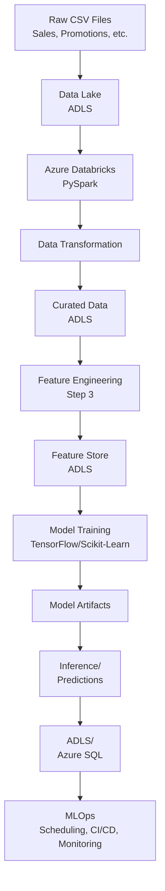

# CPG Demand Forecasting: End-to-End on Azure

## Overview
This repository demonstrates a complete end-to-end Consumer Packaged Goods (CPG) Demand Forecasting pipeline using the following technologies:

### Microsoft Azure:
- Azure Data Lake Storage (ADLS)
- Azure Databricks
- (Optional) Azure SQL Database
- PySpark for data ingestion and transformations
- TensorFlow / Scikit-Learn for model training
- (Optional) Azure Machine Learning or MLflow for model registry
- MLOps concepts (automation, version control, scheduling)

The solution is broken down into 6 major steps.

## Architecture Diagram (High-Level)



## Folder Structure

```
cpg_demand_forecasting/
├── data/                      # (Optional) local sample data
├── notebooks/
│   ├── 1_Environment_Setup.md          # Documentation or notebook references
│   ├── 2_Data_Ingestion_Transform.ipynb
│   ├── 3_Feature_Engineering.ipynb
│   ├── 4_Model_Training.ipynb
│   ├── 5_Inference.ipynb
│   └── 6_MLOps_Production_Notes.md
├── scripts/                   # Python scripts (ETL, model training) if not using notebooks
├── models/                    # (Optional) stored local model artifacts
├── .gitignore
└── README.md                  # Project overview (this file)
```
*(Adjust as needed: you can keep everything in notebooks or break them out into scripts.)*

## Steps

### Step 1: Environment & Azure Setup
1. Create or use an Azure Free Account (or existing subscription)
2. Provision a Resource Group (e.g., `cpg-rg`) and an Azure Data Lake Storage account (with hierarchical namespace)
3. Create an Azure Databricks workspace (minimal cluster, auto-termination)
4. (Optional) Create an Azure SQL Database if you plan on storing predictions in a relational database
5. Verify connectivity between Databricks and ADLS (SAS token or service principal)

#### Key Artifacts
- Resource Group: `cpg-rg`
- Storage Account: `cpgstoragexyz`
- Databricks Workspace: `cpg-dbx-workspace`

### Step 2: Data Ingestion & Basic Transformation
1. Obtain or generate sample CSV data (e.g., `sales_data.csv`)
2. Upload to Data Lake (e.g., raw container)
3. In Databricks, read the CSV with PySpark and perform basic cleaning (e.g., rename columns, filter invalid rows)
4. Write the cleaned/curated output back to Data Lake (e.g., curated container)

#### Highlights
- Showcasing PySpark transformations in Databricks
- Minimizing cloud compute usage by either local dev or small Databricks cluster

### Step 3: Feature Engineering
1. Load curated data from Step 2 in Databricks
2. Create additional features:
   - Date-based (day of week, month, year, holiday flags)
   - Rolling averages (7-day, 14-day, etc.)
   - Promotion merges (optional)
3. Output final "feature table" to a feature_store container or folder in ADLS

#### Highlights
- Demonstrates how PySpark window functions can compute rolling features
- Potential joins with external data like `promotions.csv`

### Step 4: Model Training
1. Load the feature table from Step 3
2. Split into train/test (often by date for time-series)
3. Train a model (e.g., RandomForestRegressor in Scikit-Learn or a TensorFlow model)
4. Evaluate with metrics (MSE, MAE, R², etc.)
5. Save the trained model locally in Databricks (e.g., `/dbfs/FileStore/models/`) or to ADLS

#### Highlights
- Compare TensorFlow vs. Scikit-Learn approaches
- Possibly use Spark MLlib if data is large, or just convert to Pandas for smaller data

### Step 5: Inference / Scoring
1. Load the trained model from Step 4
2. Gather new/future data (e.g., `future_data.csv` with upcoming dates, prices, promotions)
3. Apply the same feature engineering steps to match training features
4. Predict future sales
5. Store predictions in ADLS as `future_predictions.parquet` or optional Azure SQL DB table

#### Highlights
- You see how data flows from new data → model → final predictions
- Showcases a real forecast use case

### Step 6: Production & MLOps (Optional Advanced)
1. Automate each step with Databricks Jobs or Azure Data Factory pipelines
2. Version Control & CI/CD:
   - Store notebooks/scripts in GitHub (this repo!)
   - Use GitHub Actions or Azure DevOps to test & deploy changes
3. (Optional) Model Registry:
   - Use MLflow or Azure ML to track model versions & metrics
4. Monitoring & Model Drift:
   - Periodically retrain if data changes significantly

#### Highlights
- Professional MLOps lifecycle approach
- Continuous improvement of the model with minimal manual intervention

## Results & Discussion
- **Forecast Accuracy**: Evaluate MSE, MAE, or MAPE on a hold-out dataset
- **Scalability**: Thanks to PySpark, the pipeline can handle larger datasets if needed
- **Cost Management**: By using minimal-tier Databricks clusters and small data volumes, this project can remain near zero cost

## How to Run

### Local:
- Install Python 3.9+, pyspark, tensorflow, scikit-learn
- Use local folders or Docker for SQL if you skip Azure-based SQL

### Azure:
- Use a free trial or student credits
- Carefully spin down Databricks clusters to avoid charges
- Basic-tier Azure SQL is around $4.90/month if you go that route

## Additional Notes
- You can pick Scikit-Learn or TensorFlow for model training, or compare both
- If you want to skip Azure SQL due to cost, store predictions in ADLS
- For an advanced demonstration, add a Power BI or Dash front-end to visualize historical sales vs. forecast

## License & References

### License
MIT (you can specify whichever license you prefer)

### References
- [Azure Free Account](https://azure.microsoft.com/free/)
- [Databricks Documentation](https://docs.databricks.com/)
- [PySpark Official Docs](https://spark.apache.org/docs/latest/api/python/)
- [Scikit-Learn Docs](https://scikit-learn.org/stable/)
- [TensorFlow Docs](https://www.tensorflow.org/docs)